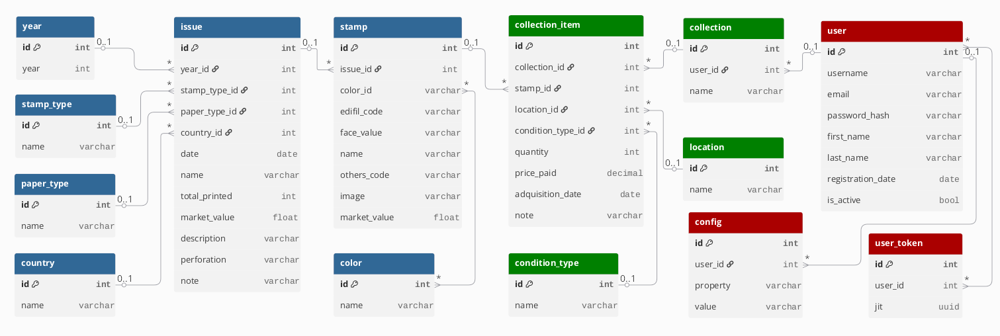

# Stamps Collection Web App
This project is an application to store and stamps collection. It has two differentiated parts:

- The backend (API REST interface). 
- The frontend (User's interfaces).

## Backend
The backend is made with the Django framework. It provides an API to access the stamps collection stored in the database. For each one of the entities in the database, a django app will be created to handle the REST interface for that entity.

### Stamp Collection Database Schema

This document provides a detailed description of the database schema for the Stamp Collection application. The model is designed to organize and manage data related to stamp issues, individual stamps, and associated metadata.

The overall database structure is illustrated below:

#### 1. Core Entities

#### `issue`
Represents a specific issue of stamps, often a series or set released at a particular time. This is the central entity linking various lookup tables.

| Column Name | Data Type | Key Type | Description |
| :--- | :--- | :--- | :--- |
| **id** | `INT` | PK | Unique identifier for the issue. |
| **year_id** | `INT` | FK | The year of the issue (links to `year.id`). |
| **date** | `DATE` | | Release date of the issue. |
| **name** | `VARCHAR` | | Name or description of the issue. |
| **total_printed** | `INT` | | Total number of stamps printed for this issue. |
| **market_value** | `FLOAT` | | Estimated market value of the issue as a set. |
| **stamp_type_id** | `INT` | FK | Type of stamp in this issue (links to `stamp_type.id`). |
| **paper_type_id** | `INT` | FK | Type of paper used (links to `paper_type.id`). |
| **description** | `VARCHAR` | | Detailed description of the issue. |
| **country_id** | `INT` | FK | Country of origin for the issue (links to `country.id`). |
| **note** | `VARCHAR` | | Any additional notes for the issue. |
| **perforation** | `VARCHAR` | | Perforation details (e.g., "13", "11.5x12"). |

#### `stamp`
Represents an individual stamp within an `issue`.

| Column Name | Data Type | Key Type | Description |
| :--- | :--- | :--- | :--- |
| **id** | `INT` | PK | Unique identifier for the stamp. |
| **issue_id** | `INT` | FK | The issue this stamp belongs to (links to `issue.id`). |
| **edifil_code** | `VARCHAR` | | Edifil catalog code for the stamp. |
| **face_value** | `VARCHAR` | | Denominative face value (e.g., "10c", "1€"). |
| **name** | `VARCHAR` | | Name or description of the individual stamp. |
| **others_code** | `VARCHAR` | | Other catalog codes for the stamp. |
| **image** | `VARCHAR` | | Path or URL to the image of the stamp. |
| **color_id** | `INT` | FK | The main color of the stamp (links to `color.id`). |
| **market_value** | `FLOAT` | | Estimated market value of the individual stamp. |

---

#### 2. Collection Management

#### `collection`
Represents a user's personal stamp collection.

| Column Name | Data Type | Key Type | Description |
| :--- | :--- | :--- | :--- |
| **id** | `INT` | PK | Unique identifier for the collection. |
| **user** | `VARCHAR` | | Identifier for the user who owns the collection. |
| **name** | `VARCHAR` | | Name of the collection. |

#### `collection_item`
A junction table linking individual stamps to user collections, essentially recording ownership.

| Column Name | Data Type | Key Type | Description |
| :--- | :--- | :--- | :--- |
| **id** | `INT` | PK | Unique identifier for the collection item instance. |
| **collection_id** | `INT` | FK | The collection this item belongs to (links to `collection.id`). |
| **stamp_id** | `INT` | FK | The individual stamp included (links to `stamp.id`). |
| **location_id** | `INT` | FK | Associated location for the issue (links to `location.id`). |
| **condition_type_id** | `INT` | FK | Current condition of the stamp (links to `condition.id`). |
| **condition_type_id** | `INT` | FK | Current condition of the stamp (links to `condition.id`). |

---

#### 3. Lookup Tables (Reference Data)

#### `year`
Stores the unique years associated with stamp issues.

| Column Name | Data Type | Key Type | Description |
| :--- | :--- | :--- | :--- |
| **id** | `INT` | PK | Unique identifier. |
| **year** | `INT` | | The specific year value. |

#### `stamp_type`
Categorizes the different types of stamps.

| Column Name | Data Type | Key Type | Description |
| :--- | :--- | :--- | :--- |
| **id** | `INT` | PK | Unique identifier. |
| **name** | `VARCHAR` | | Name of the stamp type (e.g., "Commemorative", "Definitive"). |

#### `paper_type`
Defines the types of paper used for stamps.

| Column Name | Data Type | Key Type | Description |
| :--- | :--- | :--- | :--- |
| **id** | `INT` | PK | Unique identifier. |
| **name** | `VARCHAR` | | Name of the paper type. |

#### `location`
Stores geographical locations relevant to stamp issues (e.g., cities, regions).

| Column Name | Data Type | Key Type | Description |
| :--- | :--- | :--- | :--- |
| **id** | `INT` | PK | Unique identifier. |
| **name** | `VARCHAR` | | Name of the location. |

#### `country`
Lists countries associated with stamp issues.

| Column Name | Data Type | Key Type | Description |
| :--- | :--- | :--- | :--- |
| **id** | `INT` | PK | Unique identifier. |
| **name** | `VARCHAR` | | Name of the country. |

#### `color`
Defines available colors for stamps.

| Column Name | Data Type | Key Type | Description |
| :--- | :--- | :--- | :--- |
| **id** | `INT` | PK | Unique identifier. |
| **name** | `VARCHAR` | | Name of the color (e.g., "Red", "Blue"). |

#### 4. Configuration

#### `config`
Stores application configuration settings as simple key-value pairs.

| Column Name | Data Type | Key Type | Description |
| :--- | :--- | :--- | :--- |
| **property** | `VARCHAR` | PK | Name of the configuration property (key). |
| **value** | `VARCHAR` | | Value of the configuration property. |

#### 5. Relationships Summary

| Source Table | Relationship | Target Table | Description |
| :--- | :--- | :--- | :--- |
| **`issue`** | Many-to-One (FKs) | `year`, `stamp_type`, `paper_type`, `location`, `country` | An `issue` is categorized by a single entry from each of these reference tables. |
| **`stamp`** | Many-to-One (FK) | `issue` | Every `stamp` belongs to one specific `issue`. |
| **`stamp`** | Many-to-One (FK) | `color` | Every `stamp` is associated with one primary `color`. |
| **`collection_item`** | Many-to-One (FK) | `collection` | Every `collection_item` belongs to one `collection`. |
| **`collection_item`** | Many-to-One (FK) | `stamp` | Every `collection_item` records the ownership of one specific `stamp`. |

### REST API Endpoints 
For detailed information about all available REST endpoints, please refer to the [API Documentation](./backend/readme_api.md).

## Frontend
TBD.

### Things to consider
- https://nicegui.io/ for Frontend
- https://justpy.io/ for Frontend
- https://github.com/reactive-python/reactpy for Frontend
- https://www.gradio.app/ for Frontend
- https://reflex.dev/ for Frontend
