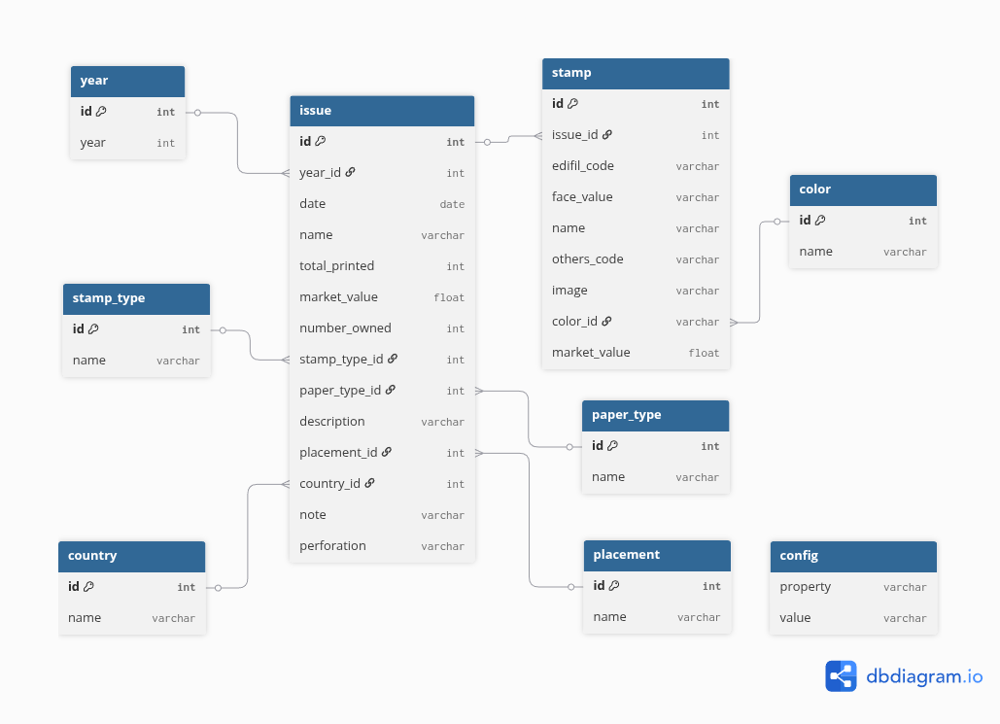

# Stamps Collection Web App
This project is an application to store and stamps collection. It has two differentiated parts:

- The backend (API REST interface). 
- The frontend (User's interfaces).

## Backend
The backend is made with the Django framework. It provides an API to access the stamps collection stored in the database. For each one of the entities in the database, a django app will be created to handle the REST interface for that entity.

### The database model
The following model will be used for the stamps collection (made with ```dbdiagram.io```):



#### 1. **Year Table**
- **id (int, PK):** Unique identifier for each year.
- **year (int):** The calendar year associated with stamp issues.

This table provides a chronological framework for organizing stamp issues.

#### 2. **Issue Table**
- **id (int, PK):** Unique identifier for each issue.
- **year_id (int, FK):** References the `year` table, linking an issue to a specific year.
- **date (date):** The exact release date of the issue.
- **name (varchar):** Name or title of the issue.
- **number_printed (int):** Total number of stamps printed in this issue.
- **value (float):** The face value of the issue.
- **number_owned (int):** Number of stamps from this issue owned by the collector.
- **number_stamps (int):** Total number of distinct stamps included in this issue.
- **stamp_type (int, FK):** References `stamp_type`, categorizing the issue.
- **total_value (float):** The cumulative value of stamps owned from this issue.
- **image (varchar):** Path or reference to an image representing the issue.
- **description (varchar):** A descriptive text about the issue.
- **located_in (int, FK):** References the `location` table to specify where the issue is stored.
- **premium (int):** Flag or indicator denoting premium status.
- **note (varchar):** Additional notes or remarks.
- **perforated (varchar):** Details about stamp perforation.

The `issue` table serves as the central hub of the schema, connecting most related entities.

#### 3. **Stamp Table**
- **id (int, PK):** Unique identifier for each stamp.
- **issue_id (int, FK):** References the `issue` table, linking the stamp to its parent issue.
- **edifil_code (varchar):** Catalog code from the Edifil cataloging system.
- **face_value (varchar):** The nominal printed value on the stamp.
- **name (varchar):** Name or description of the stamp.
- **others_code (varchar):** Additional catalog codes from other cataloging systems.
- **color (varchar):** The primary color of the stamp.

This table details individual stamps within a given issue, including catalog and physical attributes.

#### 4. **Stamp_Type Table**
- **id (int, PK):** Unique identifier for each stamp type.
- **name (varchar):** Name of the stamp type (e.g., commemorative, definitive, airmail).

Defines classification categories for stamp issues.

#### 5. **Location Table**
- **id (int, PK):** Unique identifier for each storage location.
- **name (varchar):** Describes the physical or logical storage (e.g., album, folder, box).

Tracks the physical or digital location of stamp issues.

#### 6. **Config Table**
- **property (varchar):** Name of the configuration property.
- **value (varchar):** Value assigned to the property.

Provides system-level configuration settings or customizable metadata.

#### **Overall Structure and Relationships**
- A **year** contains many **issues**.
- An **issue** contains many **stamps**, and is associated with a **stamp_type** and a **location**.

## Frontend
TBD. 

### Things to consider
- https://nicegui.io/ for Frontend
- https://justpy.io/ for Frontend
- https://github.com/reactive-python/reactpy for Frontend
- https://www.gradio.app/ for Frontend


